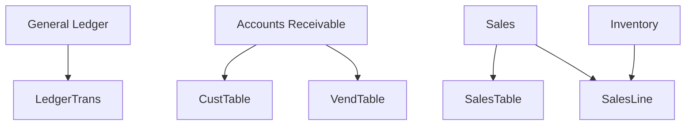

# 📘 Microsoft Dynamics AX SQL Backend Overview

**Role:** Associate Solutions Architect
**Audience:** Alan (Stakeholder), Alex (President, Aeristo)

## 🛠️ Tech Stack


This document outlines how Microsoft Dynamics AX (based on AX 2012 and earlier) stores and organizes backend SQL data. It’s designed to inform both technical and non-technical stakeholders at Aeristo.

---

## ✅ Are All Tables in One SQL Database?

**Yes**, Microsoft Dynamics AX uses a **single SQL Server database** to house all AX data. While AX is modular from the user interface (e.g., Accounts Receivable, General Ledger), these modules are centralized under one database in the backend.

### 📌 Example Database Names:

```text
AX2012R3_Production
AX_DEV
AX_Test
```

Each database will include tables across all AX modules.

---

## 🔍 How to Identify the AX Database in SQL Server

### 1. Search for the AX Database in SSMS:

```sql
SELECT name, create_date FROM sys.databases
WHERE name LIKE '%AX%';
```

### 2. Explore Key Tables:

```sql
SELECT * FROM CustTable;      -- Customer master
SELECT * FROM VendTable;      -- Vendor master
SELECT * FROM SalesTable;     -- Sales order headers
SELECT * FROM SalesLine;      -- Sales order lines
SELECT * FROM LedgerTrans;    -- General ledger transactions
```

### 3. Typical Fields in AX Tables:

* `RECID` – Unique identifier
* `DATAAREAID` – Legal entity or company code
* `PARTITION` – Tenant or environment segment (AX 2012 R2+)
* `CREATEDDATETIME`, `MODIFIEDDATETIME` – Audit fields

---

## 🎯 BONUS: Mapping AX GUI to SQL Tables

From the AX front-end (like the "Accounts receivable" area shown in the screenshot), you can identify the backend tables:

### Option 1: AOT (Application Object Tree)

1. Open **Tools > Development > Application Object Tree**
2. Navigate to the relevant form (e.g., `SalesTable`)
3. Expand **Data Sources** to reveal underlying tables

### Option 2: Right-Click Menu

* On any form, **right-click > Personalize > View Table** to see the table name used in the backend

---

## ✅ Summary Table

| Feature            | Description                                    |
| ------------------ | ---------------------------------------------- |
| One DB or Multiple | One database per AX environment                |
| DB Names           | `AXDB`, `AX2012R3`, `DynamicsAX`               |
| Common Tables      | `CustTable`, `SalesTable`, `LedgerTrans`, etc. |
| Unique Fields      | `RECID`, `DATAAREAID`, `PARTITION`             |
| Find Table in GUI  | Use AOT or "View Table" in the AX client       |

---

## 📈 Visual Schema Map

Below is a simplified schema diagram rewritten as a **Mermaid-compatible workflow**, showing how Dynamics AX modules relate to key SQL tables:



This diagram helps both technical and non-technical users understand that while modules appear separate in the front-end, their data feeds into centralized SQL tables tied by business functions.

---

If needed, we can also produce a **deeper schema** showing joins, relationships, and real-world reporting examples (e.g., aging reports, revenue recognition, payment forecasts). Let me know!
