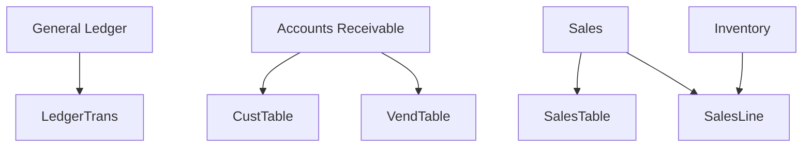
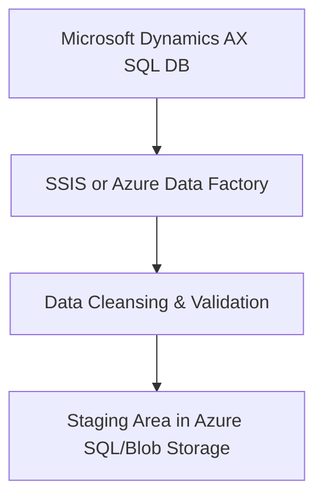
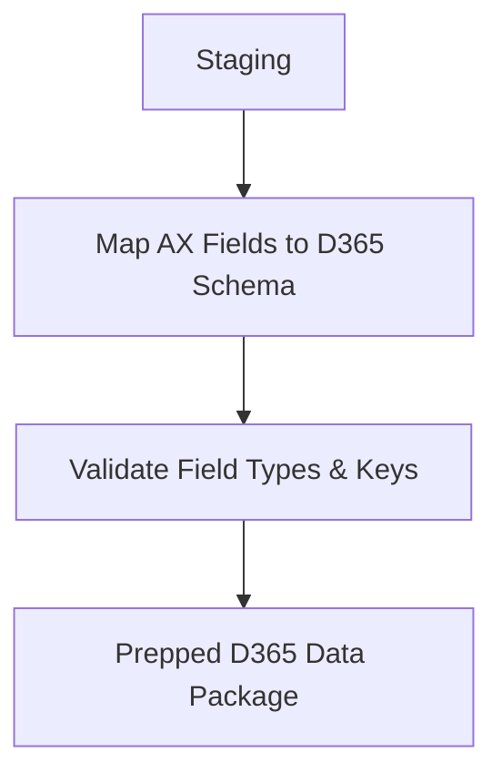

# 📘 Microsoft Dynamics AX SQL Backend Overview

**Role:** Associate Solutions Architect
**Audience:** Alan (Stakeholder), Alex (President, Aeristo)

## 🛠️ Tech Stack


This document outlines how Microsoft Dynamics AX (based on AX 2012 and earlier) stores and organizes backend SQL data. It’s designed to inform both technical and non-technical stakeholders at Aeristo.

---

## ✅ Are All Tables in One SQL Database?

**Yes**, Microsoft Dynamics AX uses a **single SQL Server database** to house all AX data. While AX is modular from the user interface (e.g., Accounts Receivable, General Ledger), these modules are centralized under one database in the backend.

### 📌 Example Database Names:

```text
AX2012R3_Production
AX_DEV
AX_Test
```

Each database will include tables across all AX modules.

---

## 🔍 How to Identify the AX Database in SQL Server

### 1. Search for the AX Database in SSMS:

```sql
SELECT name, create_date FROM sys.databases
WHERE name LIKE '%AX%';
```

### 2. Explore Key Tables:

```sql
SELECT * FROM CustTable;      -- Customer master
SELECT * FROM VendTable;      -- Vendor master
SELECT * FROM SalesTable;     -- Sales order headers
SELECT * FROM SalesLine;      -- Sales order lines
SELECT * FROM LedgerTrans;    -- General ledger transactions
```

### 3. Typical Fields in AX Tables:

* `RECID` – Unique identifier
* `DATAAREAID` – Legal entity or company code
* `PARTITION` – Tenant or environment segment (AX 2012 R2+)
* `CREATEDDATETIME`, `MODIFIEDDATETIME` – Audit fields

---

## 🎯 BONUS: Mapping AX GUI to SQL Tables

From the AX front-end (like the "Accounts receivable" area shown in the screenshot), you can identify the backend tables:

### Option 1: AOT (Application Object Tree)

1. Open **Tools > Development > Application Object Tree**
2. Navigate to the relevant form (e.g., `SalesTable`)
3. Expand **Data Sources** to reveal underlying tables

### Option 2: Right-Click Menu

* On any form, **right-click > Personalize > View Table** to see the table name used in the backend

---

## ✅ Summary Table

| Feature            | Description                                    |
| ------------------ | ---------------------------------------------- |
| One DB or Multiple | One database per AX environment                |
| DB Names           | `AXDB`, `AX2012R3`, `DynamicsAX`               |
| Common Tables      | `CustTable`, `SalesTable`, `LedgerTrans`, etc. |
| Unique Fields      | `RECID`, `DATAAREAID`, `PARTITION`             |
| Find Table in GUI  | Use AOT or "View Table" in the AX client       |

---

## 📈 Visual Schema Map

Below is a simplified schema diagram rewritten as a **Mermaid-compatible workflow**, showing how Dynamics AX modules relate to key SQL tables:



This diagram helps both technical and non-technical users understand that while modules appear separate in the front-end, their data feeds into centralized SQL tables tied by business functions.

---

If needed, we can also produce a **deeper schema**

---

## 🔁 Migration & ETL Strategy: Microsoft AX ➡️ Dynamics 365 Business Central

As Aeristo's Solutions Architect, this section outlines a complete Microsoft-first solution to migrate historical AX data into D365 Business Central using supported tools, authentication protocols, and structured workflows.

### 🧰 Tech Stack


---

### 📋 Step 1: Assess and Extract Data from AX SQL

* Identify all AX tables to migrate (e.g., `CustTable`, `SalesTable`, `LedgerTrans`)
* Extract data using **Azure Data Factory** or **SSIS (SQL Server Integration Services)**
* Cleanse data and convert to compatible formats



---

### 🔁 Step 2: Transform and Map to D365-Compatible Format

* Use **Dataflows in Azure Data Factory**
* Align AX fields with Business Central schema
* Use **mapping data flows** to restructure for BC tables



---

### 🔐 Step 3: Authenticate and Load via Microsoft APIs

* Use **OData v4 endpoints** in D365 Business Central
* Authenticate using **Azure AD + OAuth2** with **App Registration**
* Load using **Azure Functions** or **Data Migration Toolkits**

```mermaid
flowchart TD
    OutputD365 --> Auth[Azure AD + OAuth2 (App Registration)]
    Auth --> OData[OData v4 API Endpoint]
    OData --> D365[Business Central Tables]
```

---

### ✅ Best Practices for Compatibility

* Match `RECID` and surrogate keys to **UUIDs** or native D365 IDs
* Ensure consistent `DATAAREAID` to `Company` values in BC
* Convert `DATETIME` formats to ISO 8601
* Use **test sandbox** before going live
* Leverage **Business Central Configuration Packages** for pre-validation

---

### 📦 Deliverables

* ETL pipeline (Azure Data Factory JSON templates)
* Data dictionary and mapping guide
* Auth tokens and API keys stored in Azure Key Vault
* GitHub actions/workflows for version control and CI/CD of ETL jobs

Below are exportable templates and reporting examples to accompany the migration:

---

## 🧩 SQL Join Example: Sales Header + Sales Lines + Customers

```sql
SELECT 
    SH.SALESID, 
    SL.ITEMID, 
    CUST.ACCOUNTNUM, 
    SL.QTY, 
    SL.LINEAMOUNT
FROM 
    SalesTable SH
JOIN 
    SalesLine SL ON SH.SALESID = SL.SALESID
JOIN 
    CustTable CUST ON SH.CUSTACCOUNT = CUST.ACCOUNTNUM
WHERE 
    SH.DATAAREAID = 'USMF';
```

---

## 📊 Reporting Example 1: Aging Report (Receivables)

Use Power BI or D365’s Financial Reporting module:

* Aged buckets (0-30, 31-60, 61-90, 90+)
* Join `CustTable` with `CustTrans` (customer transactions)
* Filter by open balance and due date

```sql
SELECT 
    CUST.ACCOUNTNUM, 
    CUST.NAME,
    TRANS.DUE, 
    DATEDIFF(DAY, TRANS.DUE, GETDATE()) AS DaysPastDue, 
    TRANS.AMOUNTMST
FROM 
    CustTable CUST
JOIN 
    CustTrans TRANS ON CUST.ACCOUNTNUM = TRANS.ACCOUNTNUM
WHERE 
    TRANS.REMAINAMOUNTMST > 0;
```

---

## 📈 Reporting Example 2: Revenue Recognition

* Join `LedgerTrans` with `ProjInvoiceTable`
* Use account number and date ranges to classify revenue period

```sql
SELECT 
    L.ACCOUNTNUM, 
    L.TRANSDATE, 
    L.AMOUNTMST, 
    P.PROJID, 
    P.INVOICEDATE
FROM 
    LedgerTrans L
JOIN 
    ProjInvoiceTable P ON L.VOUCHER = P.VOUCHER
WHERE 
    L.ACCOUNTNUM LIKE '4000%'  -- Revenue accounts
    AND L.TRANSDATE BETWEEN '2024-01-01' AND '2024-12-31';
```

---

## ⚙️ Exportable Templates & CI/CD Components

| Component                          | Description                                                        |
| ---------------------------------- | ------------------------------------------------------------------ |
| `adf_pipeline_ax_to_bc.json`       | Azure Data Factory ETL pipeline for migrating Sales + Customers    |
| `mapping_dictionary.xlsx`          | Excel file mapping AX field names to D365 schema equivalents       |
| `function_load_odata.js`           | Azure Function template using OAuth2 to post to BC OData endpoints |
| `azure-keyvault.yaml`              | ARM template to provision secrets for authentication               |
| `.github/workflows/deploy-etl.yml` | GitHub Actions workflow for auto-deployment of ETL pipelines       |

Let me know if you want these zipped and published to a GitHub repo or exported in a specific format (ARM, Bicep, YAML, JSON).. showing joins, relationships, and real-world reporting examples (e.g., aging reports, revenue recognition, payment forecasts). Let me know!

